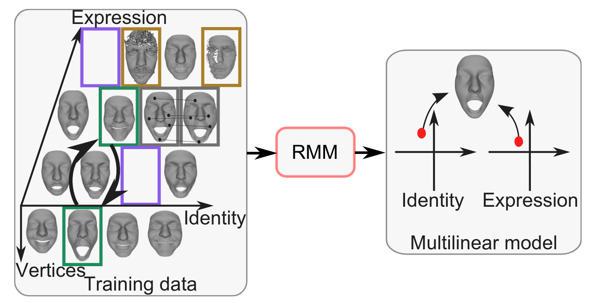
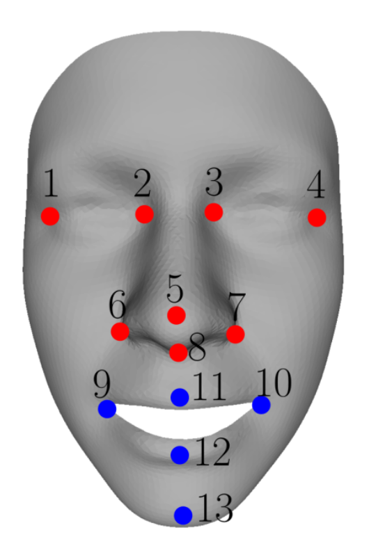

## A Robust Multilinear Model Learning Framework for 3D Faces 

The provided program robustly learns a multilinear model from databases with missing data, corrupt data, wrong semantic correspondence, and inaccurate vertex correspondence as described in the scientific publication (CVPR 2016) [[paper](https://hal.inria.fr/hal-01290783/document)] [[video](https://hal.inria.fr/hal-01290783/file/SupplementaryVideo.avi)].

<p align="center"> 

</p>

### Setup

The provided code has dependencies on the following libraries:
* Insight Segmentation and Registration Toolkit ITK (http://www.itk.org/). We recommend using ITK 4.50.
* Clapack (http://www.netlib.org/clapack/). Clapack must be compiled using Blas (USE BLAS WRAP must be enabled when using CMake). We recommend using Clapack 3.2.1.
* Approximate Nearest Neighbor Library ANN (http://www.cs.umd.edu/ mount/ANN/). We recommend using ANN 1.1.2.

To setup the provided code, use CMake and specify the required ITK, Clapack and ANN paths. Successfully compiling the project outputs a RMM.exe.

### Basic usage

Given an initially registered 3D face database, RMM optimizes the per-vertex correspondence by re-parametrizing each shape. If some shapes are missing or corrupt, RMM completes the missing shape and corrects the corrupt shapes. Further, RMM optimizes the expression labeling during optimization by optimizing the semantic
correspondence. The correspondence optimization requires an initial discrete 2D parametrization together with a thin-plate spline that defines a continuous mapping from 2D parameter space to the surface of each face. To compute thin-plates for an initial parametrization, RMM.exe must be called with the option −tps. To robustly learn a multilinear model, RMM.exe must be called with the option −rmm.

##### Parametrization
To compute thin-plates for an initial discrete parametrization, RMM.exe must be called with following four parameters, separated by a blank.
* -tps - Option to compute the thin-plate splines.
* dataFolder - Directory that contains the registered data and the file collection (also output folder).
* fileCollection - Container file with the file names of all faces used to learn the multilinear model (file name only).
* textureCoordsFile - File that contains the initial discrete parametrization in the same order as the vertices of each registered face.

This computes and outputs for each existing geometry file of the file collection the corresponding thin-plate spline. The thin-plate spline file is named automatically according the corresponding geometry file.

##### Optimization
To robustly learn a multilinear model, RMM.exe must be called with following seven parameters, separated by a blank.
* -rmm - Option to compute the model learning.
* dataFolder - Directory that contains the registered data, the thin-plate splines, and the file collections.
* fileCollection - Container file with the file names of all faces used to learn the multilinear model (file name only).
* modelLmkIndexFile - File that contains the indices of the landmarks used for reconstructing the corrupt data (file name only)
* curruptFileCollection - Container that contains the additional information of the corrupt data scan (file name only)
* outerBoundaryFile - File that contains the vertex indices of the outer boundary vertices.
* innerBoundaryFile - File that contains the vertex indices of the inner boundary vertices.
* outFolder - Output directory

##### File specifications
The faces need to be provided in an OFF-file format. Let Id i Exp e.off denote the face of identity i in expression e.

* The fileCollection container for faces of I identities in E expressions is required in following format:
```
E #Expressions
I #Identities
Id 1 Exp 1.off
Id 2 Exp 1.off
.
.
.
Id I Exp 1.off
Id 1 Exp 2.off
.
.
.
Id I Exp 2.off
.
.
.
Id I Exp E.off.
```

* The textureCoordsFile file with the parameters (u i , v i ) that correspond to the face vertex v i is required in following format:
```
u_1 v_1
u_2 v_2
.
.
.
u_n v_n
```

* The modelLmkIndexFile contains the indices of the landmarks used to compute the initial alignment to the corrupt data. These landmarks must correlate to the landmarks specified for the corrupt files. We recommend using following 13 landmarks:

<p align="center"> 

</p>

* The curruptFileCollection contains the mapping of the geometry files that not present, but a corrupt face scan is specified. The name of the corrupt face scan must differ from the corresponding geometry file. The file is required in following format:
```
geometryFile 1.off corrFile 1.off corrLmkFile 1.tlmk
.
.
.
geometryFile n.off corrFile n.off corrLmkFile n.tlmk
```
There, the geometryFile i.off represents the geometry file from the model file collection, and the corrFile i.off represents the corresponding corrupt face scan. The landmarks of the corrupt scan are specified within the corrLmkFile i.tlmk which must be in correspondence to the landmarks of the face template (within the modelLmkIndexFile).

* The landmark files corrLmkFile i.tlmk are of the format
```
# Specified 3D Landmark File
13 landmarks:
Outer left eye corner
x 1 y 1 z 1
Inner left eye corner
x 2 y 2 z 2
Inner right eye corner
x 3 y 3 z 3
Outer right eye corner
x 4 y 4 z 4
Nose tip
x 5 y 5 z 5
Left nose peak
x 6 y 6 z 6
Right nose peak
x 7 y 7 z 7
Subnasal point
x 8 y 8 z 8
Left mouth corner
x 9 y 9 z 9
Right mouth corner
x 10 y 10 z 10
Upper lip outer middle
x 11 y 11 z 11
Lower lip outer middle
x 12 y 12 z 12
Chin middle
x 13 y 13 z 13
```
If some of the landmarks cannot be specified due to noise or partial occlusions, the coordinates and the labels of these landmarks must be removed. Note that the actual number of landmarks (second line of the file) must be adjusted accordingly in this case.

### Example

The example Run RMM.cmd learns a multilinear model for a small dataset of four identities in three expressions each. First, Run RMM.cmd compute the thin-plate splines for the faces present and second, it learns a multilinear model while jointly optimizing the vertex correspondence, estimating the missing shapes, and correcting the shapes of the corrupt shapes. Further, the semantic correspondence is optimized.

### Note
In the case a multilinear face model should be computed from noisy or incomplete data without optimizing the vertex correspondence, one can disable the switch OPTIMIZE VERTEX CORRESPONDENCE within the MDLHelper.cpp. If the semantic correspondence should not be optimized, one can disable the switch OPTIMIZE SEMANTIC CORRESPONDENCE within the MDLHelper.cpp. Running the model learning without vertex correspondence and semantic correspondence optimization might also be useful for large databases, as both optimizations are computationally expensive.

### License
The source is provided for NON-COMMERCIAL RESEARCH PURPOSES only, and is provided as is WITHOUT ANY WARRANTY; without even the implied warranty of fitness for a particular purpose. The redistribution of the code is not permitted.

### Citing

When using this code in a scientific publication, please cite 
```
@inproceedings{BolkartWuhrer2016_rmm,
  title = {A Robust Multilinear Model Learning Framework for {3D} Faces},
  author = {Bolkart, Timo and Wuhrer, Stefanie},
  booktitle = {Conference on Computer Vision and Pattern Recognition (CVPR)},
  pages={4911-4919},
  year={2016}
}
```


